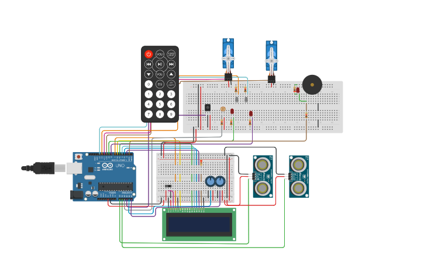

# steerable-wheelchair

Hi!  
There is and Arduino project that EPF ask me to do:  
Realization a arduino circuit to steer wheelchair with 2 servomotors, a lcd display, a speaker, a joystick and a remote.  
The project was carried out on tinkercad in compliance with health regulations due to Covid.  

